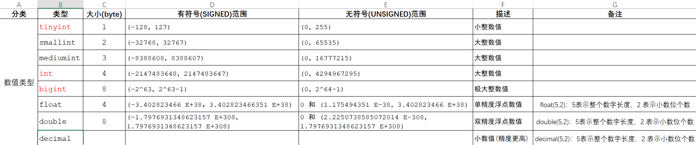
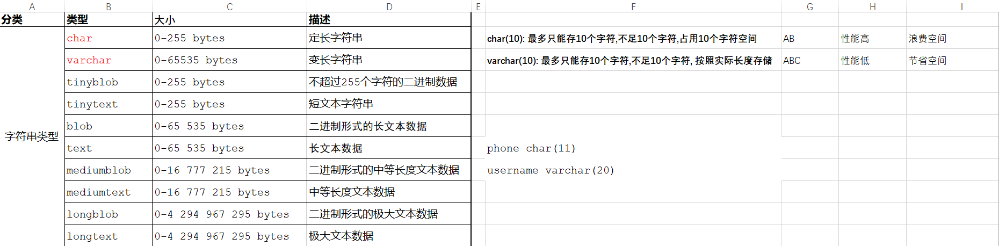
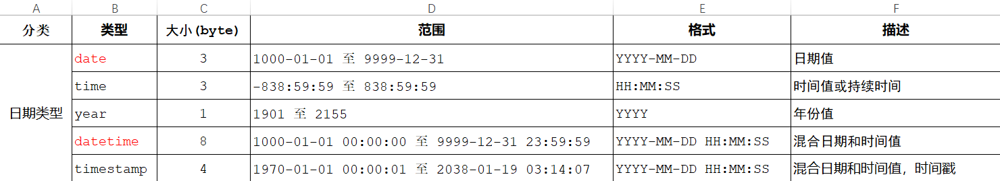
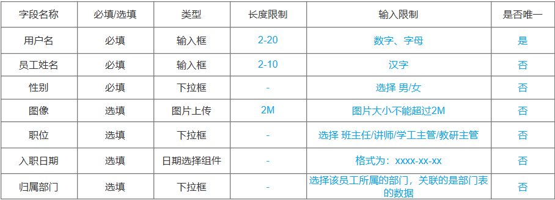

以一个模拟的 “员工信息表”（employees）为例：

```sql
create table employees {
	-- primary key 主键约束 主键是一行数据的唯一标识，要求非空且唯一；auto_increment 自动增长
    employee_id INT PRIMARY KEY AUTO_INCREMENT comment '员工编号，唯一标识每个员工',
    first_name VARCHAR(50) NOT NULL comment '员工的名',
    last_name VARCHAR(50) NOT NULL comment '员工的姓',
    age INT comment '员工年龄',
    -- enum 枚举类型 只允许从指定的几个值中选取一个作为该字段的值
    gender ENUM('Male', 'Female', 'Other') comment '员工性别',
    -- unique 唯一约束，保证字段的所有数据都是唯一、不重复的
    email VARCHAR(100) UNIQUE comment '员工电子邮箱，需保证唯一性',
    -- date 存储日期信息  not null 不为空
    hire_date DATE NOT NULL comment '员工入职日期',
    -- decimal(p, q) 用于存储精确小数，p总的数字位数（包括小数点前后），q小数点后的位数
    salary DECIMAL(10, 2) comment '员工薪资，保留两位小数',
    department_id INT comment '员工所在部门编号',
    -- default 默认约束 保存数据时，如果未指定该字段值，则采用默认值
    is_active TINYINT(1) DEFAULT 1 comment '员工是否在职，1表示在职，0表示离职',
    

    -- foreign key 添加外键约束，关联到departments表的department_id字段
    FOREIGN KEY (department_id) REFERENCES departments(department_id) comment '关联到部门表的外键，确定员工所属部门'
}[comment '此表用于存储公司所有员工的基本信息'];
```

### 字段类型相关说明：

- **INT**：用于存储整数类型的数据，如员工编号、年龄等。这里的`employee_id`还添加了`AUTO_INCREMENT`属性，意味着每次插入新记录时，如果该字段未指定值，数据库会自动为其分配一个递增的整数值，常用于作为主键且需要自动生成唯一值的情况。
- **VARCHAR(n)**：可变长度的字符类型，`n`表示最大可存储的字符数。用于存储像员工的姓名、电子邮箱等文本信息，其长度会根据实际存储内容动态调整，节省空间。
- **ENUM**：枚举类型，在示例中用于定义员工性别，只允许从指定的几个值（'Male'，'Female'，'Other'）中选择一个作为该字段的值，保证了数据的规范性。
- **DATE**：专门用于存储日期信息，格式如`YYYY-MM-DD`，这里用于存储员工入职日期。
- **DECIMAL(p, q)**：用于存储精确的小数值，`p`表示总的数字位数（包括小数点前后），`q`表示小数点后的位数。在示例中用于存储员工薪资，保留两位小数以符合常见的薪资表示方式。
- **TINYINT(1)**：通常用于存储只有两种状态的值，类似布尔类型，在示例中用于表示员工是否在职，1 表示在职，0 表示离职。

### 约束相关说明：

- **PRIMARY KEY**：定义主键约束，如`employee_id`作为主键，能唯一标识表中的每一行记录，确保每个员工都有一个独一无二的编号。
- **NOT NULL**：规定字段的值不能为空，像员工的名、姓以及入职日期等重要信息字段设置了该约束，保证这些数据的完整性。
- **UNIQUE**：确保字段的值在整个表中是唯一的，如员工的电子邮箱字段设置了该约束，防止出现两个员工使用相同电子邮箱的情况。
- **FOREIGN KEY**：用于建立表与表之间的关联，在示例中通过`department_id`字段建立了与`departments`表（假设存在）的关联，确保在`employees`表中插入的部门编号在`departments`表中是存在的，维护了数据的关联性和完整性。







### 练习设计员工表




```sql
CREATE DATABASE db02;

CREATE TABLE tb_emp(
	id INT PRIMARY KEY AUTO_INCREMENT COMMENT '主键ID',
	username VARCHAR(20) NOT NULL UNIQUE COMMENT '用户名',
	password VARCHAR(32) DEFAULT('123456') COMMENT '密码',
	name VARCHAR(10) NOT NULL COMMENT '姓名',
	gender TINYINT UNSIGNED NOT NULL COMMENT '性别：1 男，2女',
	image VARCHAR(300) COMMENT '图像URL',
	job TINYINT UNSIGNED COMMENT '职位：1 班主任，2 讲师，3 教研主管',
	entrydate DATE COMMENT '入职日期',
	create_time DATETIME NOT NULL COMMENT '创建时间',
	update_time DATETIME NOT NULL COMMENT '修改时间'
) COMMENT '员工表'
```

