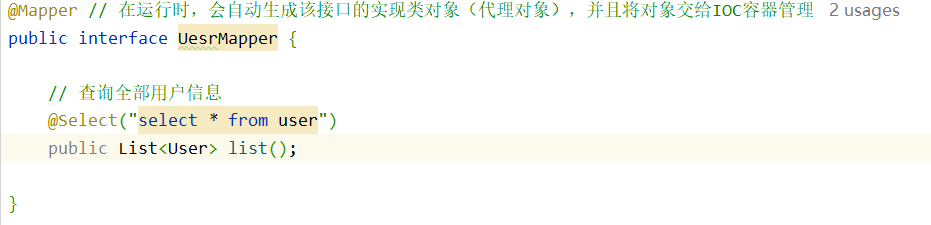
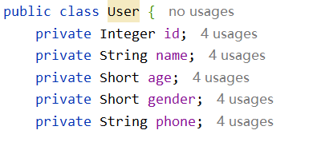
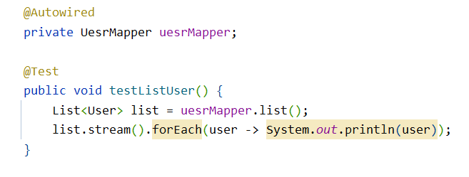

# Mybatis

一款优秀的 **持久层**框架，用于简化 JDBC 的开发

**application.properties**

```properties
#驱动类名称
spring.datasource.driver-class-name=com.mysql.cj.jdbc.Driver
#数据库连接的url
spring.datasource.url=jdbc:mysql://localhost:3306/mybatis
#连接数据库的用户名
spring.datasource.username=root
#连接数据库的密码
spring.datasource.password=root
#配置mybatis的日志，指定输出到控制台
mybatis.configuration.log-impl=org.apache.ibatis.logging.stdout.StdOutImpl
```

**UesrMapper**



**User**



**测试类**

