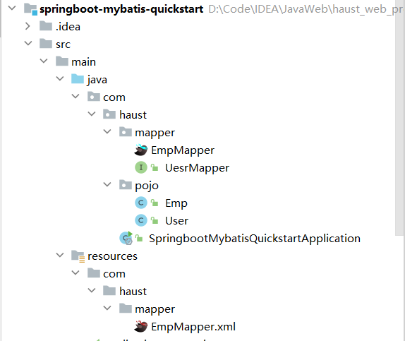

# XML映射文件

> [!IMPORTANT]
>
> - XML映射文件的名称必须与Mapper接口名称一致，并且将XML映射文件和Mapper接口放置在相同包下（**同包同名**）
> - XML映射文件的namespace属性为Mapper接口全限定名一致
> - XML映射文件中sql语句的id与Mapper接口中的方法名一致，并保持返回类型一致

**Mapper接口**

```java
@Mapper
public interface EmpMapper{
    public List<Emp> list(String name, Short gender, LocalDate begin, LocalDate end);
}
```

**XML映射文件**

```xml
<?xml version="1.0" encoding="UTF-8" ?>
<!DOCTYPE mapper
        PUBLIC "-//mybatis.org//DTD Mapper 3.0//EN"
        "http://mybatis.org/dtd/mybatis-3-mapper.dtd">

<mapper namespace="com.haust.mapper.EmpMapper">
    <!--resultType：单条记录所封装的类型-->
    <select id="list" resultType="com.haust.pojo.Emp">
        select *
        from emp
        where name like concat('%', #{name}, '%')
          and gender = #{gender}
          and entrydate between #{begin} and #{end}
        order by update_time desc
    </select>
</mapper>
```



